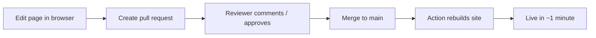

# How to write and edit documentation

You do **not** need to be a developer to contribute here. This guide is written for scrum masters, business analysts, product owners, and anyone on the agile team.

## The mental model

Think of each Markdown file as a Confluence page. The big difference: changes are **reviewed before they go live**, exactly like a document approval workflow. Nothing is lost — every version is kept and you can always see who changed what and why.

## Editing entirely in your browser (recommended for most people)

1. Open the page you want to change on GitHub and click the **pencil icon** (✏️ *Edit this file*). On the published site, the same pencil in the top-right of any page takes you straight here.
2. Make your edits in Markdown (see the cheat-sheet below).
3. Scroll down to **Commit changes**. Write a short summary of what you changed (e.g. *"Add acceptance criteria to HEL-142"*).
4. Choose **Create a new branch and start a pull request**.
5. Click **Propose changes**, then **Create pull request**, and add a reviewer.

That's it. A reviewer approves, the change merges, and the site updates automatically.

!!! tip "Prefer a nicer editor?"
    Press <kbd>.</kbd> (the period key) on any repo page to open **github.dev**, a full VS Code editor in your browser — great for editing several files at once. No installation needed.

## The review workflow at a glance



## Where does my document go?

| I'm writing… | Put it in… | Start from template |
|--------------|-----------|---------------------|
| An epic | `docs/epics/` | `docs/doc-templates/epic-template.md` |
| A user story | `docs/stories/` | `docs/doc-templates/user-story-template.md` |
| A BRD | `docs/brds/` | `docs/doc-templates/brd-template.md` |
| Release notes | `docs/release-notes/` | `docs/doc-templates/release-note-template.md` |
| Meeting / ceremony notes | `docs/meeting-notes/` | `docs/doc-templates/meeting-notes-template.md` |

After adding a **new** page, also add one line to the `nav:` list in `mkdocs.yml` so it appears in the site menu. (A reviewer can help with this the first few times.)

## Markdown in 60 seconds

```markdown
# Heading 1
## Heading 2

**bold**  ·  *italic*  ·  `code`  ·  [link text](https://example.com)

- bullet list
1. numbered list

- [ ] open task
- [x] done task

> quote / callout

| Column A | Column B |
|----------|----------|
| cell     | cell     |
```

### Confluence-style callouts (admonitions)

```markdown
!!! note "Optional title"
    This renders as a colored info panel, like a Confluence info macro.

!!! warning
    Use for risks and gotchas.
```

### Diagrams (no image tools needed)

Fenced ```mermaid blocks render as flowcharts, sequence diagrams, and Gantt charts directly on the site — the equivalent of Confluence's diagram macros.

## Linking to work items

Reference an epic or story by its ID (e.g. `HEL-142`). If you paste a link to a GitHub Issue or GitHub Projects item, GitHub shows a rich preview and keeps planning and documentation connected. See the Wiki's *Projects integration* page for the full pattern.

## Golden rules

- **One topic per page.** Small pages are easier to review and find.
- **Use a template** so every epic/story/BRD looks consistent.
- **Write a meaningful commit summary** — it becomes the page's change history.
- **Link, don't copy.** Point to the source of truth instead of duplicating it.
