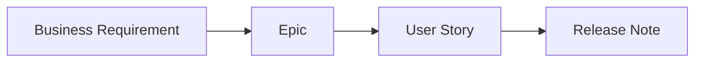

# Getting Started

This page explains how the documentation space is organized and how to work in it. Read it once and you'll know where everything lives.

## The information hierarchy

We document work at four levels of detail, each linking to the next:

| Level | Answers | Owned by | Lives in |
|-------|---------|----------|----------|
| **BRD** | *Why* are we doing this, and *what* must be true for the business? | Business Analyst | `docs/brds/` |
| **Epic** | *What* large capability delivers that value? | Product Owner | `docs/epics/` |
| **User Story** | *What* thin slice can we ship in a sprint? | Team / PO | `docs/stories/` |
| **Release Note** | *What* actually shipped and when? | Scrum Master / RM | `docs/release-notes/` |

## Naming conventions

- **Epics:** `EPIC-00X` — e.g. `EPIC-001 Instant Payments`.
- **Stories:** `HEL-###` — matching the ID in GitHub Projects (our Jira replacement).
- **Files:** lowercase, hyphenated, prefixed with the ID — e.g. `hel-142-send-instant-payment.md`.

## Finding things

- **Search** (top of every page) indexes the full text of the site — faster than browsing.
- **Left navigation** mirrors the folder structure.
- **Cross-links** connect related BRDs, epics, and stories. Follow the trail.

## Ceremonies and where their output goes

| Ceremony | Output | Location |
|----------|--------|----------|
| PI / Release planning | Objectives, committed epics | `docs/meeting-notes/` |
| Sprint planning | Sprint goal, committed stories | GitHub Projects + story pages |
| Sprint review | Demo notes, accepted stories | `docs/reports/` |
| Retrospective | Actions & owners | `docs/reports/` |

## Your first contribution

1. Open [Templates](doc-templates/index.md) and copy the one you need.
2. Create your page in the right folder (see the table above).
3. Propose the change as a pull request — the [contributing guide](https://github.com/JesusESD/agile-docs-demo/blob/main/CONTRIBUTING.md) walks you through it.
