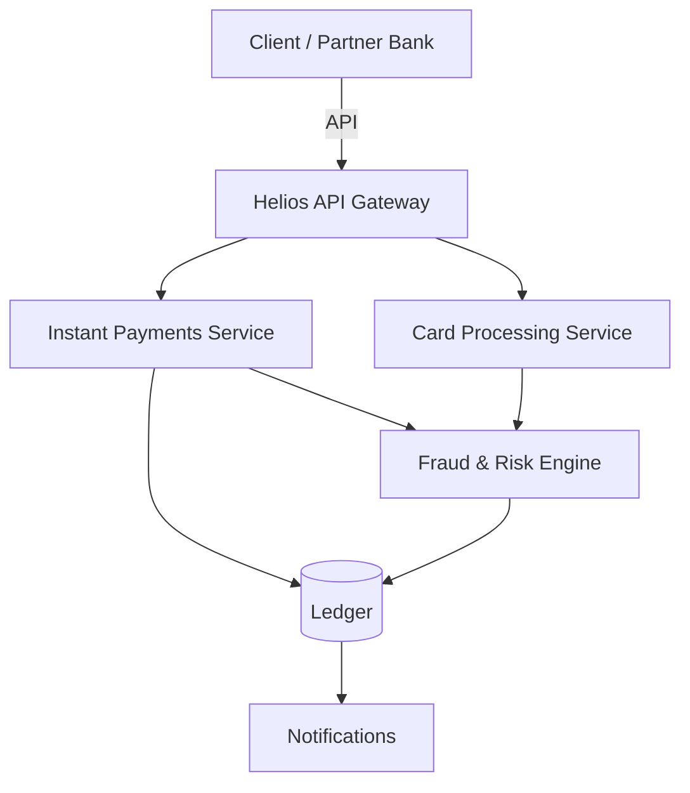

# Helios Payments — Documentation Home

Welcome to the documentation space for the **Helios Payments Platform**. This is where the agile team plans, specifies, and records everything we build.

!!! info "What is this?"
    A living, searchable knowledge base — the equivalent of a Confluence space — powered entirely by GitHub. Every page is written in Markdown, reviewed like a change request, and published here automatically.

## Start here

- :material-rocket-launch: **[Getting Started](getting-started.md)** — how this space is organized and how to find things.
- :material-file-tree: **[Epics](epics/index.md)** — the large bodies of work on our roadmap.
- :material-clipboard-text: **[User Stories](stories/index.md)** — the incremental, deliverable slices of value.
- :material-file-document: **[Business Requirements](brds/index.md)** — the "why" and "what" agreed with the business.
- :material-tag: **[Release Notes](release-notes/index.md)** — what shipped, when, and to whom.
- :material-chart-line: **[Reports](reports/index.md)** — sprint reviews and retrospectives.
- :material-account-group: **[Meeting Notes](meeting-notes/index.md)** — PI planning and key decisions.
- :material-content-copy: **[Templates](doc-templates/index.md)** — start any document from a consistent baseline.

## Our documentation principles

1. **Single source of truth.** If it's a plan, requirement, or decision, it lives here — not in scattered chat messages or email.
2. **Traceable.** Business need → BRD → Epic → Story → Release. Every level links to the next.
3. **Reviewed.** Documentation changes go through pull requests, so nothing changes silently.
4. **Versioned.** Every edit is kept forever, with who changed it and why.

## Product overview

Helios is a cloud-native payments platform providing instant account-to-account transfers, card processing, and real-time fraud screening for mid-market financial institutions.

!!! tip "Editing a page"
    See the pencil icon at the top-right of any page? Click it to propose an edit right from your browser. Read [how contributing works](https://github.com/your-username/agile-docs-demo/blob/main/CONTRIBUTING.md) first.
