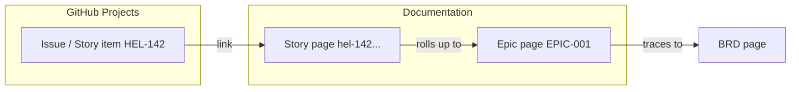

# Connecting Documentation to Planning (GitHub Projects)

This page shows how our **documentation** (GitHub docs/Wiki) connects to our **planning** (GitHub Projects — the Jira replacement), so the two never drift apart.

## The pattern

## How to link them

- **From an Issue/Projects item → to a doc:** paste the doc URL in the issue description. GitHub renders a preview.
- **From a doc → to an Issue:** reference the issue number (e.g. `#142`) or paste the link. GitHub auto-links it.
- **Keep IDs aligned:** the story ID in Projects (`HEL-142`) matches the doc file name (`hel-142-...md`). One ID, two views.

## Why this beats a Confluence + Jira split

- **One platform, one login, one permission model** — no cross-tool sync plugins.
- Links are **native and bidirectional**; closing an issue can reference the doc, and the doc points back to the issue.
- Projects **Insights** gives burndown/velocity charts (Jira-dashboard equivalent) right next to the docs.

## Quick reference

| I want to… | Do this |
|------------|---------|
| Track work status | GitHub Projects board |
| See burndown/velocity | Projects → Insights |
| Specify what to build | Story/epic pages in `/docs` |
| Record why | BRD pages in `/docs` |
| Jot quick reference | This Wiki |
